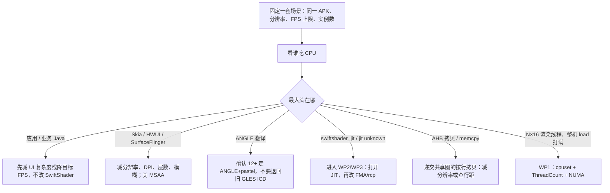
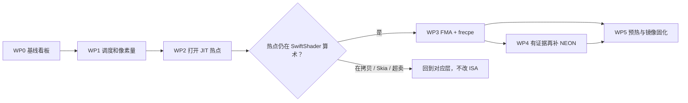

# 鲲鹏服务器软渲染热点优化 Proposal

面向：**没接触过 SwiftShader、图形学基础很少**，但要把鲲鹏上的渲染 CPU 热点压下去的人。

本文是一份可以立项的方案：先讲你在优化什么，再讲必须先量什么，最后按顺序给出工作包、成功标准和明确不做的事。

术语、x86 历史、FMA/`frecpe` 为什么值钱，见 [SoftwareRenderingOptimization.zh.md](SoftwareRenderingOptimization.zh.md)。  
当前源码怎么分层、一次绘制走哪，见 [src-architecture/overview.zh.md](src-architecture/overview.zh.md)。  
`SwiftShader.ini` 语法见 [RuntimeConfiguration.zh.md](RuntimeConfiguration.zh.md)。  
WP0 基线表（可直接复制填写）见 [WP0-baseline-template.zh.md](WP0-baseline-template.zh.md)。

**WP** 是 Work Package 的缩写，中文叫 **工作包**：把一件大事拆成可以独立验收的一小段。WP0、WP1…只是编号，0 最先做，不是「优先级 0 可以跳过」。没有 WP0 那张填好的表，后面的改动无法证明变快了。

文中第一次出现的缩写：

| 缩写 | 全称 | 人话 |
|------|------|------|
| **AHB** | AHardwareBuffer | Android 用来在进程之间递「一块已经画好的图」的共享缓冲。redroid 上往往是一块 memfd。应用画完要拷进去，SurfaceFlinger 再读出来叠层。提案里说的「AHB 拷贝 / 按行 memcpy」就是这次递交，**还不是**在算着色器。 |
| HWC | Hardware Composer | 真显卡/显示控制器上的「硬件叠层」。没有 GPU 时通常不可用，合成只好再走 GLES。 |
| JIT | 即时编译 | 跑着的时候才把着色器变成 CPU 机器码。 |
| MSAA | 多重采样抗锯齿 | 每个像素算多次再平均，软渲染上很贵。 |

---

## 0. 先读这半页

你没有 GPU（或不用 GPU）。Android 界面仍以为自己在对「显卡」说话，实际每个像素都在 **鲲鹏 CPU** 上算。做这件事的库叫 **SwiftShader**（Android 里常叫 `vulkan.pastel`）。

**热点**不是一个函数名，而是：采样一段时间后，CPU 把时间花在哪。软渲染时，时间经常堆在一块 **匿名可执行内存** 上，perf 显示成 `jit unknown` / `swiftshader_jit`。那不是病毒，是 SwiftShader 运行时现编出来的「画像素函数」。

不要一上来改 SVE、也不要先写一整层 `rr::arm`。在鲲鹏上，顺序必须是：

1. **先分清热点在哪一层**（应用 / Skia / ANGLE / SwiftShader JIT / 上屏 memcpy / 调度抢核）。
2. **先砍像素量和线程超卖**（通常比改指令涨得更快）。
3. **再打开热点**：让 JIT 能对上函数名和几条汇编。
4. **最后改 SwiftShader 里 ARM 被关掉的快路径**（FMA、近似倒数），并且只用同一套场景做 A/B。

鲲鹏 920 官方是 **ARMv8.2 + 128 位 NEON，不支持 SVE**。SwiftShader 的向量宽度正好是 4 个 float，和 NEON 对齐。你的主战场是「同样 4 个数，少用慢指令、少画废像素、别让 100 个容器各起 16 条渲染线程」，不是换一套更宽的向量架构。

---

## 1. 你在优化什么（不用先学完图形学）

### 1.1 一条业务链

云手机 / redroid 无 GPU 时，常见路径：

```text
应用或系统 UI
  → HWUI / Skia     把按钮、文字、列表变成「画什么」
    → OpenGL ES     应用以为在对显卡说话
      → ANGLE       把 GLES 翻译成 Vulkan
        → SwiftShader (vulkan.pastel)
            SPIR-V 着色器 → 在 CPU 上 JIT 成机器码 → 填像素
          → 把画面拷进 AHB（AHardwareBuffer，给合成器看的共享图）
            → SurfaceFlinger 把各层窗口叠成你看见的那一张
```

你不需要会写着色器。要记住的只有：

- **像素越多越慢**：分辨率 × 帧率 ≈ CPU 工作量。
- **层越多越慢**：应用画一遍，SurfaceFlinger 合成时 **常常再走一遍 SwiftShader**（见 §1.3）。
- **SwiftShader 不会解释执行着色器**：它把 SPIR-V（着色器中间码）变成一份 CPU 函数，放进匿名可执行页。所以热点看起来像 `jit unknown` 是预期现象。
- **一次处理 4 个像素**（2×2 的 quad），方便走 NEON。

### 1.3 SurfaceFlinger 工作时还要不要 SwiftShader？

**无 GPU 时，经常还要，而且是另一个进程里再跑一套。**

可以把它想成「先各自在纸上画画，再由一个人把几张纸叠成你看见的那一张」：

| 谁 | 干什么 | 无 GPU 时算像素的人 |
|----|--------|---------------------|
| 应用（或系统 UI） | 把自己的窗口画到一块缓冲 | 这个进程里的 SwiftShader（GLES → ANGLE → pastel） |
| 把画好的图交给合成器 | 缓冲变成 **AHB**（共享图）；常有一次按行 `memcpy` | 仍是应用这边的 SwiftShader / `prepareForExternalUseANDROID`，还不是 SurfaceFlinger 在叠层 |
| **SurfaceFlinger** | 把状态栏、应用、导航栏、弹窗等 **层** 叠成屏幕 | 没有硬件合成器（HWC）可用时，它自己也用 GLES 做「GPU 合成」。这条 GLES **同样落到 ANGLE + SwiftShader**，进程名是 `surfaceflinger` |

所以不是「应用画完，SurfaceFlinger 只做内存搬运就结束」。没有真显卡的 Overlay / HWC 时，Android 的默认退路叫 **GPU composition**：合成器当一个 GLES 客户端去混合图层。鲲鹏上没有 GPU，「GPU composition」= 再请 SwiftShader 算一遍。

现网里已经见过：嵌套 redroid 上，**SurfaceFlinger 进程**里 JIT 热点的 90%+ 落在 `PixelRoutine` + `sampler`（见 [overview.zh.md](src-architecture/overview.zh.md)）。那就是合成阶段又在跑 SwiftShader，不是应用残留。

例外（这时合成 **可以** 几乎不进 SwiftShader）：

- 屏幕上只有一层不透明全屏，合成器只是把这块缓冲指给虚拟显示（少见，桌面+状态栏通常不满足）。
- 以后若走宿主机 GPU / 半虚拟化 HWC，合成在真 GPU 上完成，那是另一条产品线。
- 某些实现会用 CPU blit 叠两层而不走完整 GLES；那是 memcpy/混合循环，perf 里不像 `swiftshader_jit`，而像拷贝。

因此 WP0 必须对 **应用进程** 和 **surfaceflinger** 各采一次 perf。只采应用，会漏掉「叠层」那一半 CPU。层数、半透明、模糊、圆角会放大 SurfaceFlinger 这一侧；减层、减分辨率对这一侧同样有效。

### 1.2 「降低热点」的正确含义

产品目标不是「perf 里某个符号变矮」，而是同时成立：

| 指标 | 含义 | 为什么要一起看 |
|------|------|----------------|
| 单容器 FPS / P99 帧时间 | 人眼是否跟得上、是否卡顿 | 只降 CPU%、画面更稀，不算成功 |
| 单容器渲染 CPU% | 这个实例吃了多少核 | 热点下降的直接读数 |
| 整机可开实例数 | 密度 | 单容器把 `ThreadCount` 拉到 16，整机一扩容全员掉帧 |
| 抖动 | 偶发卡一下 | JIT 首次编译、抢核、NUMA 跨节点都会表现为抖，而不只是平均 FPS |

建议立项时写成两句，避免互相拆台：

- **单容器**：目标套餐 UI 场景达到可接受 FPS（例如 20 或 30），P99 帧时间可控。
- **整机**：`实例数 × 每实例渲染线程 ≈ 物理核`，并给 `system_server`、SurfaceFlinger、网络留余量。

---

## 2. 目标、非目标、成功标准

### 2.1 目标

1. 建立一套 **可复现的鲲鹏测量方法**：固定 APK、固定分辨率、固定 FPS 上限，能回答「时间在哪一层」。
2. 用 **不改指令** 的手段先把超卖和像素量按住（配额、`ThreadCount`、分辨率、目标帧率、关 MSAA）。
3. 在确认热点落在 SwiftShader JIT 且汇编里有密 `fdiv` 之后，**实现** ARM 的近似倒数（不是只改 `fmaIsFast()`）。
4. 只有汇编证明某段是标量循环或真除法时，再补饱和 / pack / Blitter。

### 2.2 非目标（本期不做）

| 不做 | 原因 |
|------|------|
| SVE / 可变长向量 | 鲲鹏 920 **官方不支持 SVE**（例如 7260、TaiShan 200 2280）。就算以后换 930 一代，SwiftShader 也写死 `SIMD::Width = 4`，上 SVE 等于换光栅架构。 |
| 把像素管线加宽到 8 | 和 2×2 quad、subgroup=4 绑在一起，不是「降现网热点」的第一刀。 |
| 给 Subzero 补 ARM64 | ARM64 产品路径用 LLVM。 |
| 整份镜像 `x86.hpp` 的 `rr::arm` | 加减乘 LLVM 往往已经能吐 NEON；维护成本高。 |
| 为了躲 ANGLE 退回老 `libGLESv2_swiftshader` | Android 12+ 正路是 ANGLE + pastel，乱换容易崩 SurfaceFlinger。 |
| 先改应用 / 重写 Skia | 除非 WP0 证明热点根本不在 SwiftShader。 |

宿主机 GPU 直通 / 半虚拟化是另一条产品线（「不要用软渲染」），不要和本提案混成一个里程碑。

### 2.3 成功标准（建议写进验收）

**WP0 完成**：能拿出一张填完的 [WP0 表](WP0-baseline-template.zh.md)，列出目标场景下各层 CPU 占比（应用、Skia/HWUI、ANGLE、`swiftshader_jit`、AHB 拷贝、SurfaceFlinger、内核/软中断），误差可复现。

**WP1 完成**：在「整机实例数上去」的前提下，单容器 FPS 不塌；每实例渲染线程数等于该容器 cpuset，而不是 16。相对 WP0 默认配置，渲染 CPU% 或可开实例数有 **明显** 变化（经验上常常是几十个百分点量级，以实测为准）。

**WP2 完成**：能指出热点 JIT 是 `PixelRoutine`、`sampler` 还是上屏拷贝；对最热的那份函数能拿出几行反汇编（有没有 `fdiv`、`fmul+fadd`、标量循环）。

**WP3 完成**：同一镜像、同一 APK、同一分辨率，打开 FMA + 近似倒数后，目标场景 FPS / CPU% / P99 有记录；画面没有明显色偏或闪烁。预期诚实：**几个点到一成多**，采样特别重时更高。达不到不要靠把分辨率偷偷改小来「做出」增益。

**WP4 完成**：每一项 NEON 补丁都对应 WP2 的一条汇编证据，而不是指令集手册刷完成度。

---

## 3. 鲲鹏这台机器意味着什么

先在一台目标服务器上跑，把结果写进 WP0 报告（不要凭感觉）：

```bash
lscpu
# 看：型号（Kunpeng-920 / 其它）、CPU(s)、Socket、NUMA node、Thread(s) per core
lscpu | grep -i sve || true
# 920 上通常没有 sve 标志
cat /proc/cpuinfo | head -n 40
```

对方案有影响的几点：

| 鲲鹏常见事实 | 对软渲染的含义 |
|--------------|----------------|
| 核非常多（单路 48/64，双路上百，四路可到 256） | 容器若能看见整机核，每个 redroid 都可能按 `min(可见核, 16)` 起渲染线程。一百个容器 × 16 是灾难。 |
| 通常 **1 线程/核**（无 SMT） | `ThreadCount` 超卖没有「超线程缓冲」，就是硬抢物理核。 |
| **NUMA 多节点** | 渲染线程和帧缓冲不在同一节点时，memcpy / 写回颜色会变贵。绑定比再改一条 SIMD 更先做。 |
| **NEON 128 位、4×float32** | 和 SwiftShader `SIMD::Width = 4` 天生对齐。LLVM 对普通加减乘往往会自己发 NEON。 |
| **ARMv8 自带 FMLA** | 硬件有融合乘加。产品路径走 `MulAdd`→`llvm.fmuladd`，LLVM 在 ARM 上常常已经能吐 `fmla`。`fmaIsFast()` 几乎没人调用，不要指望改一行探测就变快。 |
| **有 `frecpe` / `frsqrte`** | 近似倒数 / 反平方根。`HasRcpApprox()` 只在 x86 为 true，且 ARM 上 `RcpApprox()` 是空实现。这才是值得写代码的点。 |
| **官方 920 无 SVE** | 不要把「上 SVE」写进本期里程碑。 |
| 内存带宽被很多核分享 | 1080p × 高 FPS × 多实例会先打满带宽，再谈指令。 |

微架构代号是 TaiShan v110（GCC 有 `-mcpu=tsv110`）。那是编 **静态库** 的选项。SwiftShader 最热的代码是 **运行时 LLVM JIT 出来的**，不会因为你给宿主机 gcc 加了 `-mcpu=tsv110` 就自动变快。JIT 目标机器要另看 LLVM 给 AArch64 选的 CPU features，不要把「重编 SwiftShader 用 tsv110」当成主杠杆。

---

## 4. 从何开始：先分清热点在哪

没有这张图，后面所有改代码都可能改错层。



### 4.1 第 0 天就要确认的事实

在 **容器内** 和 **宿主机** 各看一遍：

```bash
# 驱动是否真是软渲染
getprop ro.hardware.vulkan          # 期望 pastel
getprop ro.hardware.egl             # 常见 angle / 视镜像而定
getprop ro.opengles.version

# 这个进程能看见多少核（决定默认 ThreadCount）
nproc
# SwiftShader.ini 是否在「进程 cwd」而不是 .so 旁边
ls -l /proc/$(pidof surfaceflinger)/cwd/SwiftShader.ini  2>/dev/null
# 实际工作进程可能是 surfaceflinger 或某个渲染进程，按你们镜像改 pid
```

redroid 无 GPU 默认大约：宽 1280、DPI 320、FPS 15。有人把 FPS 锁 30/60 又开 1080p，CPU 直接翻倍，这不是「SwiftShader 没优化」，是像素量翻倍。

### 4.2 怎么量（不需要会图形）

用 **同一套操作路径**（例如：解锁 → 桌面 → 打开设置滑到底 → 打开浏览器滚一页），录 20～60 秒。

**1）进程和线程**

```bash
# 宿主机：谁在吃核
top -H -p <容器内 surfaceflinger 或渲染进程在宿主机的 pid>
# 看线程名是否出现大量 SwiftShader / ANGLE / HwuiTask
```

若每个容器都有接近 16 条忙着的渲染线程，先做 WP1，不要做 WP3。

**2）整机是否超卖**

```text
实例数 × 每实例 ThreadCount  ？>  物理核数 − 预留
```

预留：Android system、网络、宿主机管理。超卖时，ISA 优化会被调度噪声淹没，A/B 会得出「改了指令没变」的假阴性。

**3）perf：时间在哪一层**

在宿主机对目标进程：

```bash
perf record -g -p <pid> -- sleep 30
perf report
```

你会经常看到一大块匿名 `r-xp` / `jit unknown`。结合 `/proc/<pid>/maps` 看页名是不是 `swiftshader_jit`。

同时注意：

- `libhwui` / `libskia`：2D 自己在算，或不该那么多层。
- `libEGL` / ANGLE：翻译开销。
- `prepareForExternalUseANDROID` / 按行 memcpy：画完后把图拷进 AHB 交给合成器，会和 JIT 抢 CPU。这是搬运，改 FMA 治不了。
- 内核 `copy_to_user` / 软中断：更像 I/O 或超卖，不是改 `frecpe` 能治的。

**4）还缺名字时怎么「打开」JIT（WP2，不要和 WP3 并行乱改）**

SwiftShader 默认不写 `/tmp/perf-<pid>.map`，所以 `perf report` 对不上 `PixelRoutine_%08X`。本期建议的打开方式，按成本从低到高：

| 手段 | 做什么 | 你得到什么 |
|------|--------|------------|
| `/proc/<pid>/maps` | 看 `swiftshader_jit` 页的地址范围 | 确认匿名热点就是 JIT |
| RIP 聚类 | 对 JIT 页里的采样地址做直方图 | 同一份像素例程是否扎堆 |
| `REACTOR_EMIT_ASM_FILE` | 编译时打开，JIT 时吐汇编 | 和 RIP 对照：是 `fdiv` 还是 `fmul+fadd` |
| `SwiftShader.ini` `[Profiler] EnableSpirvProfiling=true` | 周期写出 SPIR-V 侧 profile | 哪条着色器指令热（采样、除法、混合） |
| 补 `/tmp/perf-<pid>.map` | 仿 Mesa LLVMpipe，JIT 完成时写地址和名字 | `perf report` 直接显示 `PixelRoutine_...` |

WP2 的验收是「能说话」，不是「已经更快」。

### 4.3 读汇编时只认这几件事

打开最热那份函数，在鲲鹏上你只需要会认：

| 你看到 | 含义 | 可能动作 |
|--------|------|----------|
| `fadd` / `fmul` 的向量形式（`v0.4s`） | LLVM 已经吐出 4 宽 NEON | **不要**再包一层同样的加减 |
| `fmul` 紧跟 `fadd` 算 `a*b+c` | 没走 FMA | WP3：让 `fmaIsFast()` 在 ARM 为 true |
| `fdiv` / `fsqrt` 很密 | 真除法、真开方 | WP3：`frecpe` / `frsqrte` + 牛顿迭代 |
| 标量 `ldrb`/`strb` 小循环，在混合或拷贝里 | 没向量化的 pack / Blitter | WP4，且只改这处 |
| 大量内存访问、几乎没有算术 | 带宽或格式转换 | 减分辨率，或查 AHB 那次按行拷贝，不要改 FMA |

---

## 5. 工作包（按依赖顺序，不要并行乱序）



### WP0 — 基线与看板（不改产品行为）

**谁做**：现场 + 一名能登容器的人。不需要会 C++。

**做：**

1. 冻结一套「套餐」：分辨率、DPI、`androidboot.redroid_fps`、实例数、cgroup。
2. 冻结 1～2 个 APK 路径（桌面滑动、WebView、你们最卡的那个）。
3. 打开并填写 [WP0-baseline-template.zh.md](WP0-baseline-template.zh.md)（机器、容器、场景、FPS/P99、超卖公式、应用 + surfaceflinger 的 perf 前五名）。不要自己另做一套列，否则和后面验收对不上。

4. 把「改之前」的两份 `perf report` 和一张界面截图存档。

**完成物**：一份填完的 WP0 表。没有它，后面每一刀都无法验收。

### WP1 — 调度和像素量（最大杠杆，不改 SwiftShader 源码）

**谁做**：平台 / 容器编排 + 镜像里放 ini。

**做：**

1. 每个 redroid **只能看见套餐核数**（常见 2～4），不要把 128 核暴露进去。
2. **应用进程和 `surfaceflinger` 各自加载一份 ICD**，各有一份 `ThreadCount`。ini 只认 **该进程的 cwd**（`ls -l /proc/<pid>/cwd`），不是 `.so` 所在目录。两个进程 cwd 往往不同，只给其中一个放 ini，另一边仍可能起 16 条线程。先对两个 pid 都确认 cwd 后再放：

```ini
[Processor]
ThreadCount=2
AffinityPolicy=one
```

`ThreadCount` 对齐该容器核数。`AffinityPolicy=one`：一条工作线程尽量钉在一个核上。有 NUMA 时再用 cpuset 把容器钉在 **同一节点**，必要时再收 `AffinityMask`。

3. 经验公式：

```text
实例数 ×（应用 ThreadCount + surfaceflinger ThreadCount）  ≈  物理核数 − 预留
```

4. 像素量：能 720p 就不要默认 1080p；能 15/20 FPS 就不要锁 30/60；DPI 过高会让系统按「更密的屏」多画资源。
5. 关掉 MSAA（多重采样抗锯齿，填充量成倍；ARM 上 resolve 没有 x86 那种 SSE2 快路径）。
6. 确认 `ro.hardware.vulkan=pastel`，GLES 走 ANGLE，JIT 后端是 LLVM。

**预期**：常常就能从「幻灯片」变成「能用」。先做两个 A/B：默认分辨率 vs 720p；默认线程 vs `ThreadCount=2`。

**风险**：ThreadCount 过小会导致单容器画不完一帧。用 P99 帧时间看，不要只看平均。

### WP2 — 打开热点（仍几乎不改算法）

**谁做**：一名能在宿主机上对容器进程跑 `perf` 的人。会编进 Android 镜像更好，但不是第一天必须。

**做：**

1. 在 WP1 已经不再超卖的机器上再采一次。**`perf` 打在宿主机、用宿主机看到的 pid**。容器里 `pidof` 的号和宿主机不是同一个；先用 cgroup / `ps` 对上再采。
2. 若 anon JIT < 30% 且 Skia / AHB 拷贝更大：写进报告，**WP3 降级或停**。
3. JIT 是大头时：先用 `/proc/<pid>/maps` 确认页名是 `swiftshader_jit`。`REACTOR_EMIT_ASM_FILE` 和 SPIR-V profiler 都要 **重编并替换镜像里的 so**，不要和「改探测函数」绑在同一个迭代。
4. 可选：给 JIT 完成路径补 `/tmp/perf-<pid>.map`。剖析基建，单独评审。

**完成物**：热点在算像素、采样，还是 AHB 按行拷贝；若已有汇编，热指令是除法、乘加还是内存。

### WP3 — 为什么从「这两个函数」入手，以及实际要改多少

**不是打开两个开关就结束。** 选它们，是因为 x86 已接好、鲲鹏硬件也有对应指令、代码写成「只认 x86」——改动面相对可控。对着源码看过之后，两件事的可操作性不一样。

**为什么是它们，不是 SVE / 加宽光栅**

着色器和采样里大量是 `a * b + c`（点积、多项式）和 `1/x`、`1/sqrt(x)`（透视、纹理 LOD、各向异性）。见 `SamplerCore.cpp` 的 `Rcp`、`ShaderCore.cpp` / `SpirvShaderArithmetic.cpp` 的 `MulAdd`。鲲鹏 920 的 NEON 有 `FMLA` 和 `frecpe` / `frsqrte`。仓库把「用不用快路径」收在 `Caps::fmaIsFast()` 和 `HasRcpApprox()`，ARM 分支直接 false。

**对照代码后必须改口**

1. **`fmaIsFast()` 几乎不是产品路径的开关。** 生产代码几乎没人调用它（单元测试会问一句）。真正乘加走 `MulAdd()` → `llvm.fmuladd`，AArch64 后端常常已经收成 `fmla`。只改这一行 **可能零收益**。第一刀应是反汇编最热 JIT：已有 `fmla` 就不要为这个函数立项。还要查有没有打开 `SWIFTSHADER_LEGACY_PRECISION`（为 true 时故意拆成 `x*y+z`）。

2. **`HasRcpApprox()` 才有开关意义，但不能只改返回值。** `DoRcp()` 在非 x86 上只要它为真就会调 `RcpApprox()`，而 ARM 上 `RcpApprox()` / `RcpSqrtApprox()` 是 `UNREACHABLE`（`LLVMReactor.cpp`）。只改 bool 会在生成倒数时崩。必须同时用 LLVM intrinsic 或 NEON **实现** 这两个函数，并打开 `HasRcpSqrtApprox()`。非 x86 上即使不是 relaxed precision 也会走近似（`Reactor.cpp` 的 `DoRcp`），精度靠截图和 dEQP 看，不能当一行开关。

| 项 | 真实工作量 | 什么时候做 |
|----|------------|------------|
| 反汇编确认有无 `fmla` / `fdiv` | WP2 的延伸 | **先做** |
| 实现 ARM `RcpApprox` / `RcpSqrtApprox` 并打开 `HasRcp*` | 小补丁 + 单测 + 场景 A/B | JIT 里 `fdiv`/`fsqrt` 密 |
| 只改 `fmaIsFast()` | 一行，可能零收益 | 仅当汇编证明乘加没融合，且查清是探测在挡 |

还要有「编 AArch64 SwiftShader → 打进 redroid 镜像 → 重启实例」的流水线，否则 WP3 在现网不可操作。预期：rcp 在采样重的界面可能几个点到一成多；FMA 那行可能是 0。不要承诺翻倍。

### WP4 — 有汇编证据再补的 NEON

只在 WP2 指出具体坑时立项，不要和 WP3 绑成必须做完才能上线。

候选（x86 有、ARM 走 generic 的）：

- 饱和加、pack（颜色混合收成 8 位）
- 整数 min/max、符号掩码
- `Blitter` / MSAA resolve（x86 用过 `_mm_avg_epu8`）

入口对照：`src/Reactor/x86.hpp` 与 `LLVMReactor.cpp` 里 `#if x86` 的 `else`。  
云手机 UI 更常打在 **混合、缩放、格式转换**，而不是复杂 3D 光照。

### WP5 — 预热与镜像固化

JIT 第一次碰到某种「着色器 + 混合 + 格式」会编译，表现为启动后数秒卡顿。套餐固定时：

- 启动后先跑一遍目标 APK 再对外；或
- 接受前几秒掉帧，并在监控里单独算「冷启动」。

缓存不跨容器持久化。把 WP1 的 ini、分辨率、FPS、打开过的 WP3 二进制写进镜像和编排模板。

---

## 6. 建议的人员与阅读顺序

不需要先读完一本图形学。需要会的是：Linux 上看 CPU、在宿主机对容器 pid 跑 `perf`、读几行 ARM 汇编、能把 AArch64 so 打进镜像、做 A/B。WP3 不是「改两行 bool」。

| 角色 | 负责 | 先读 |
|------|------|------|
| 平台 / 编排 | WP1、NUMA、实例密度 | 本文 §3、§5 WP1 |
| 测量 | WP0、WP2 | 本文 §4；[overview.zh.md](src-architecture/overview.zh.md) 第 3、4 节 |
| 改 SwiftShader | WP3、WP4 | [SoftwareRenderingOptimization.zh.md](SoftwareRenderingOptimization.zh.md) §3、§6；`LLVMReactor.cpp` 里 `fmaIsFast` / `HasRcpApprox` |
| 应用 / 套餐 | 分辨率、FPS、要不要 1080p | 本文 §1、§2 |

源码阅读（改代码的人，大约按这个顺序点开即可）：

1. `src/Device/Renderer.cpp` — `draw` / `processPixels`（调度，不是算法）
2. `src/Pipeline/PixelRoutine.cpp` — 像素里在干什么
3. `src/Reactor/LLVMReactor.cpp` — FMA / rcp 开关
4. `src/System/SwiftConfig.hpp` — 线程数默认值
5. 需要时再看 `SamplerCore.cpp`、`Blitter.cpp`

不要从 `Reactor.md` 的语法教程读起——那是写代码生成器用的，不是应用开发、也不是你第一周的任务。

---

## 7. 风险、回滚、和「改了没变快」

| 风险 | 怎么发现 | 怎么办 |
|------|----------|--------|
| 超卖淹没 ISA 收益 | WP1 没做就做 WP3，A/B 无差异 | 先把线程公式做对再测 |
| 近似倒数精度 | 界面色带、闪烁、错误 LOD | 只在 relaxed 路径用；对比截图；回退 `HasRcpApprox` |
| JIT 编译当热点 | 冷启动、切主题、新 APK 时 CPU 尖峰 | WP5 预热；不要当成「算术太慢」 |
| 改错层 | perf 里 Skia 或 memcpy 更大 | 停 WP3，做分辨率或拷贝路径 |
| 容器 cwd 没有 ini | `ThreadCount` 仍是 16 | 查进程 cwd，不是查 .so 路径 |
| 把 gcc `-mcpu=tsv110` 当主优化 | 静态库快了一点，JIT 热点没动 | 主杠杆仍是线程、像素、JIT lowering |

回滚：WP1 是配置，改 ini / 编排即可。WP3 是两处探测函数，保持可开关（编译宏或运行时探测），出问题关回 x86-only 行为。

---

## 8. 一页纸路线图（给评审）

```text
现在（鲲鹏 + redroid + 无 GPU）
    │
    ├─ WP0  基线：场景、FPS、CPU%、perf 前五、核数/NUMA
    ├─ WP1  每容器 2～4 核；ThreadCount 对齐；720p / 合理 FPS；关 MSAA
    ├─ WP2  热点归属：JIT / sampler / AHB 拷贝 / Skia / 抢核
    │         └─ 不是 JIT 算术？ 停止改指令
    ├─ WP3  先看汇编；有密 `fdiv` 再实现 ARM RcpApprox（不要只改 fmaIsFast）
    ├─ WP4  仅对汇编里的标量坑补 NEON
    └─ WP5  预热 + 镜像固化 + 密度公式写进运维
```

**开始优化的第一周**：只做 WP0 + WP1。若你还没在鲲鹏上对目标 APK 跑过一次 `perf report`，没有任何指令补丁是「从这里开始」。

**一句话**：在鲲鹏上降渲染热点，先让每个容器少看见核、少画像素，再分清时间是在算像素还是在拷 AHB，最后才写 ARM 的近似倒数。SVE 和加宽光栅不进本期。

---

## 9. 可操作性自检（作者复盘）

提案初稿把 WP3 写成「打开两个函数」，把 AHB 当缩写扔在 perf 表里，对没接触过图形的人 **不可操作**。对照源码后，各包实际难度如下。

| 工作包 | 新手能不能做 | 主要卡点 | 怎么才算可操作 |
|--------|--------------|----------|----------------|
| WP0 | 能，但 `perf` 容易采错进程 | 容器 pid ≠ 宿主机 pid；P99 可能没有现成脚本；AHB 不是符号名，表上看成 memcpy | 用 [WP0 模板](WP0-baseline-template.zh.md)；perf 打宿主 pid；AHB = 递交共享图的那次拷贝 |
| WP1 | **最可操作，也是最大杠杆** | ini 只认 cwd；**两个进程**各一份 ThreadCount | 对应用和 surfaceflinger 都确认 cwd；公式按两个进程加总 |
| WP2 | 中等 | 吐汇编 / SPIR-V profiler 要重编 so | 第一周只做 maps + perf 分类；吐汇编另开迭代 |
| WP3 | 初稿写轻了 | `fmaIsFast` 可能零收益；只改 `HasRcpApprox` 会 `UNREACHABLE`；要有 AArch64 进镜像的流水线 | 先反汇编；rcp 要 **实现** `RcpApprox`，不是改 bool |
| WP4 | 只在有汇编证据时 | 容易按手册刷指令 | 没有 WP2 证据就不开工 |
| WP5 | 能 | 缓存不跨容器 | 启动脚本跑一遍目标 APK |

**先做 WP0+WP1 仍然成立。** 若没有「把自编 so 打进 redroid」的能力，本期停在配置和像素量，不要空许 FMA 补丁。
