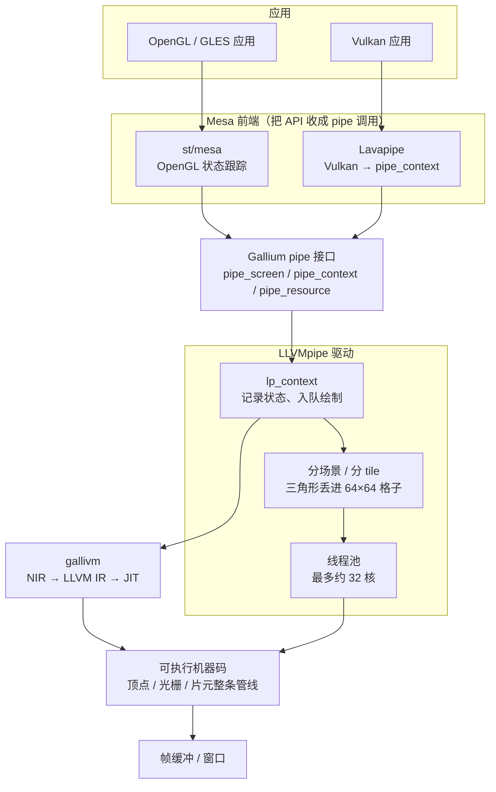
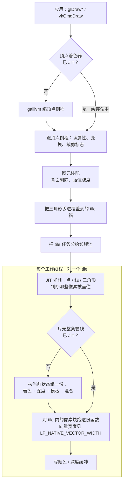
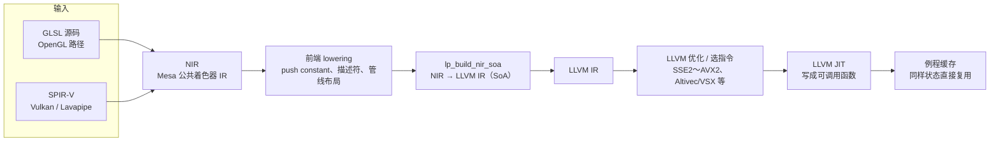
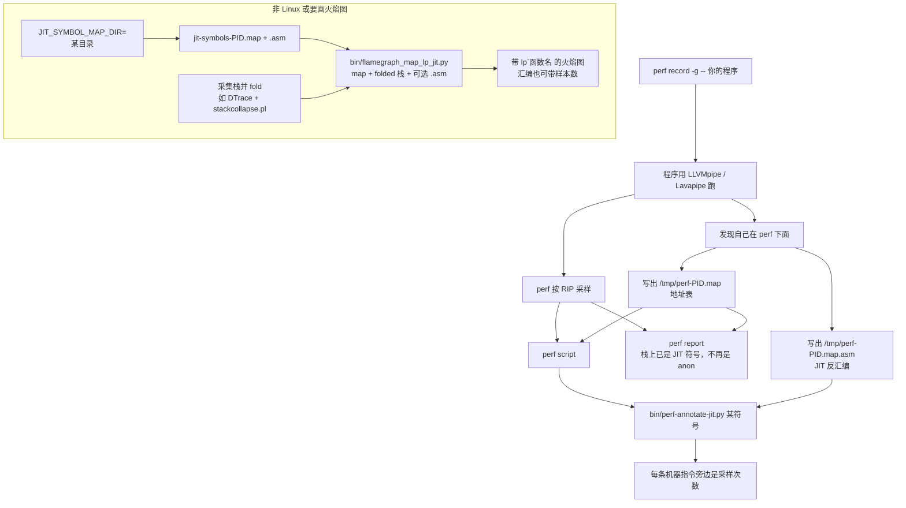

# Mesa LLVMpipe / Lavapipe 工作流图（业界对照，不是本仓库）

**SwiftShader 不包含、也不调用 Mesa。** 你的 redroid / `vulkan.pastel` 路径见 [Pipeline.zh.md](Pipeline.zh.md)。

本文只回答「业界另一套 CPU 软光栅怎么做 JIT 剖析」。上次把「pipe」画成 Mesa，是因为它和 SwiftShader 同类（状态特化 + LLVM JIT），不是因为优化 SwiftShader 要改 Mesa。

对应英文官方说明：[Mesa LLVMpipe](https://docs.mesa3d.org/drivers/llvmpipe.html)。

---

## 1. 「pipe」是什么

Mesa 把「显卡驱动该提供的能力」收成一套 C 接口，叫 **Gallium pipe**：

- `pipe_screen`：这块「卡」能干什么（格式、上限、是否有某条扩展）。
- `pipe_context`：一次绘制、一次清屏、一次算计算着色器。

上层 API（OpenGL 或 Vulkan）先翻译成这些调用，下面再接到真正干活的驱动。

| 名字 | 角色 |
|------|------|
| **Gallium** | Mesa 里那套统一驱动骨架 |
| **pipe 接口** | 骨架和驱动之间的合同 |
| **LLVMpipe** | 用 LLVM JIT 在 CPU 上实现这条 pipe 的 OpenGL 软渲染驱动 |
| **Lavapipe** | Vulkan 前端：把 `vkCmdDraw` 等拆成同一套 `pipe_context` 调用，后端仍是 LLVMpipe |
| **gallivm** | 和驱动无关的 LLVM 封装（`src/gallium/auxiliary/gallivm/`，文件前缀 `lp_bld_`） |

所以「pipe 工作流」其实是两层：

1. **画图**：应用 → API → pipe → 分 tile → JIT 出来的机器码算像素。
2. **分析**：同样那份 JIT 码，顺带写出 `/tmp/perf-PID.map` 和 `.asm`，让 `perf` / FlameGraph 能看见函数名和指令。

SwiftShader 没有 Gallium pipe；它自己的路径是 Vulkan → Renderer → Reactor → LLVM。可比的是「状态特化 + LLVM JIT + 多线程填像素」。

---

## 2. 总览：谁调用谁



读图要点：

- **Lavapipe 不是另一套光栅器**。它只是 Vulkan 翻译层；像素仍由 LLVMpipe 算。
- **pipe 接口是分界线**。上面换 API，下面可以换驱动（软渲染、硬件、Zink 等）。
- **JIT 发生在 gallivm**。第一次碰到某种着色器 + 混合/深度状态，会编一份专用函数，之后复用。

---

## 3. 一次绘制：从三角形到像素

LLVMpipe 不是「整屏一个大循环」。它先把三角形按 **tile（默认约 64×64 像素）** 分箱，再让工作线程各自处理自己的格子。片元阶段把深度测试、模板、混合和着色器 **编进同一个 JIT 函数**（入口从 `lp_state_fs.c` 看起）。



和「不懂渲染的人」对齐的几个词：

- **顶点**：三角形的三个角。顶点着色器算它们在屏幕上的位置。
- **光栅化**：判断三角形盖住哪些像素。
- **片元**：被盖住的「待着色像素」。
- **分 tile**：把屏幕切成小方块，减少线程互相抢同一块内存，也方便后期只处理脏格子。
- **特化**：当前绘制没用模板测试，生成的函数里就没有模板测试。这和 SwiftShader 的 Routine 缓存是同一类想法。

向量宽度：

- 环境变量 **`LP_NATIVE_VECTOR_WIDTH`** 可改。默认常取 `min(CPU 最大向量位宽, 256)`，也就是很多 x86 机器上走 **AVX2 的 256 位（8 个 float）**。
- 有时 128 位反而更快，所以允许覆盖。这和 SwiftShader 写死 `SIMD::Width = 4`（128 位、2×2 quad）不同。

---

## 4. 着色器怎么变成机器码

Lavapipe 和 LLVMpipe 共用后半段：都先落到 Mesa 的 **NIR**（New Intermediate Representation），再由 `lp_build_nir_soa` 变成 **SoA**（同一条 SIMD 指令处理多个像素的同一通道），最后 LLVM JIT。



建议第一次读 Mesa 源码的顺序（官方也这么写）：

1. `src/gallium/drivers/llvmpipe/lp_state_fs.c` — 片元整条管线怎么拼。
2. 它调用的 `lp_bld_*`。
3. `src/gallium/auxiliary/gallivm/` — 和具体驱动无关的 LLVM 胶水。

调试开关（环境变量 **`GALLIVM_DEBUG`**，可组合）：

| 值 | 作用 |
|----|------|
| `ir` | 打印 LLVM IR |
| `asm` | 打印 JIT 汇编 |
| `perf` | 编译耗时等性能日志 |
| `symbols` | 给 JIT 函数留符号，方便剖析 |

另有 **`GALLIVM_PERF`**：打开或关掉一些算法捷径（例如近似 LOD），用来做 A/B，不是日常开的调试开关。

---

## 5. 剖析工作流：把匿名 JIT 变成能读的名字

这是相对 SwiftShader 最值得抄的一段。Linux 上 `perf` 采样到 JIT 页时，若没有 map，热点只显示成匿名可执行内存。LLVMpipe **在被 perf 带着跑时**会写：

- `/tmp/perf-<PID>.map`：地址 → 函数名
- `/tmp/perf-<PID>.map.asm`：同一份函数的反汇编



典型命令（Linux）：

```bash
perf record -g -- ./your_app
perf report
# 再对某一个 JIT 符号做「按指令标注」：
perf script | ./bin/perf-annotate-jit.py <符号名>
```

FlameGraph 路径：先设 `JIT_SYMBOL_MAP_DIR`，跑程序，把 fold 后的栈和 map 交给 `bin/flamegraph_map_lp_jit.py`（可加 `-a` 指向 `.asm`）。

这样你看到的不再是「一大块匿名可执行」，而是类似「某片元管线函数里，这条 `divps` 吃了多少样本」。SwiftShader 默认只有 `swiftshader_jit` 这种匿名/memfd 页，没有这份 map；要对齐分析，缺的就是这一环。

---

## 6. 和 SwiftShader 并排看

```mermaid
flowchart TB
  subgraph ss["SwiftShader"]
    S1["Vulkan ICD / pastel"]
    S2["Renderer<br/>Vertex / Setup / Pixel Processor"]
    S3["Reactor 记录 IR"]
    S4["LLVM 或 Subzero JIT"]
    S5["Routine 缓存<br/>2×2 quad，宽度固定 4"]
    S6["匿名可执行页<br/>swiftshader_jit<br/>默认无 perf-PID.map"]
    S1 --> S2 --> S3 --> S4 --> S5 --> S6
  end

  subgraph mesa2["Mesa pipe"]
    M1["OpenGL st/mesa 或 Vulkan Lavapipe"]
    M2["pipe_context"]
    M3["LLVMpipe 分 tile + 线程池"]
    M4["gallivm：NIR → LLVM IR"]
    M5["LLVM JIT<br/>宽度常 256 位，可调"]
    M6["/tmp/perf-PID.map + .asm"]
    M1 --> M2 --> M3 --> M4 --> M5 --> M6
  end
```



| 步骤 | Mesa pipe | SwiftShader | 对 redroid / ARM 的含义 |
|------|-----------|-------------|-------------------------|
| API | GL 或 Vulkan（Lavapipe） | 主要是 Vulkan（上面常再叠 ANGLE） | 云手机 12+ 走 ANGLE + pastel，对标 Lavapipe 那一侧 |
| 中间表示 | NIR | Reactor（再交给 LLVM IR） | 都不是手写整游戏内核 |
| 特化单位 | 整条片元管线一份 JIT | Pixel/Vertex Routine 一份 JIT | 热点都在「按状态生成的函数」里 |
| SIMD | 常 8 宽（256 位），可改 | 死 4 宽（128 位） | 不要指望抄宽度就能涨帧；先抄 **能看见 JIT 名字** |
| 剖析 | 自动写 perf map / asm | 可选 `REACTOR_EMIT_ASM_FILE`，无 map | 匿名 JIT 占满热点时，先补 map 再谈 ISA |
| 线程 | 最多约 32 | 默认 `min(逻辑核, 16)` | 大规模容器里都要先限线程，再谈指令 |

---

## 7. 若要把这套分析接到 SwiftShader

目标不是「换成 LLVMpipe」，而是让现有 `swiftshader_jit` 页对 `perf` 变得可读：

1. JIT 完成时写 `/tmp/perf-<pid>.map`（地址、长度、`PixelRoutine_%08X` 这类名字）。Linux `perf` 会自动读这个文件。
2. 需要按指令看样本时，再写一份 `.asm`，并仿 `perf-annotate-jit.py` 做标注（或先开 `REACTOR_EMIT_ASM_FILE` 做对照）。
3. 采样时加 `-g`，用 RIP 聚类：同一像素例程里是否扎堆在除法、内存、混合。
4. 有了名字再决定改 FMA / `frecpe` 还是减分辨率——否则只能看见「匿名可执行 70%」。

环境变量备忘（Mesa 侧，对照用）：

| 变量 | 作用 |
|------|------|
| `LP_NATIVE_VECTOR_WIDTH` | 覆盖 JIT 向量位宽 |
| `GALLIVM_DEBUG` | `ir` / `asm` / `perf` / `symbols` |
| `GALLIVM_PERF` | 算法捷径开关 |
| `JIT_SYMBOL_MAP_DIR` | 不依赖 Linux perf 时，把 map 写到指定目录 |

---

## 8. 一句话

**pipe 工作流 = Gallium 合同 + LLVMpipe 分 tile 软光栅 + gallivm/LLVM 特化出机器码。**  
Lavapipe 只是把 Vulkan 接进同一条合同。剖析工作流则是：跑在 `perf` 下时写出 **map + asm**，再用官方脚本把样本对到 JIT 符号和单条指令。SwiftShader 要对齐的，首先是这套「让匿名 JIT 能被叫出名字」的回路。
