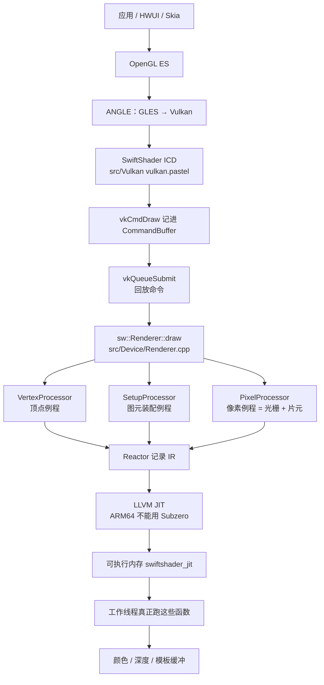
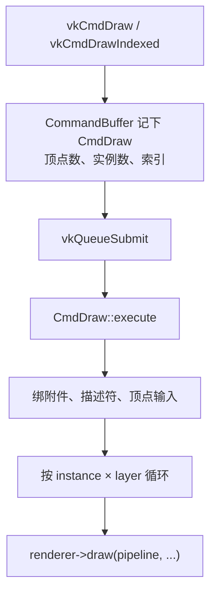
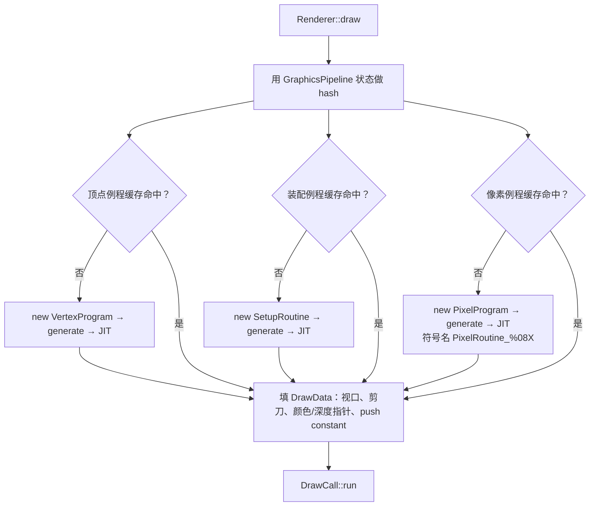
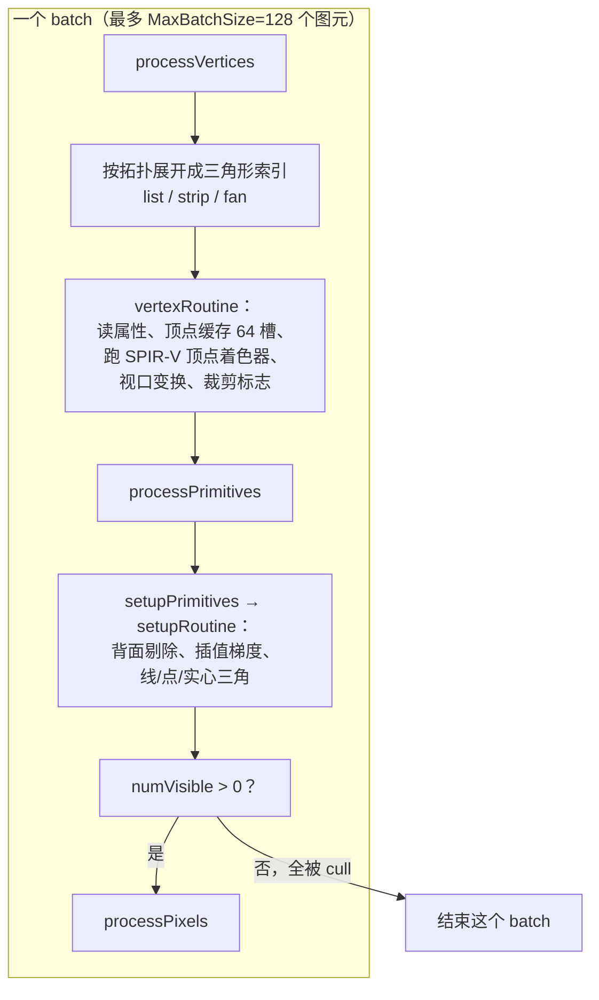
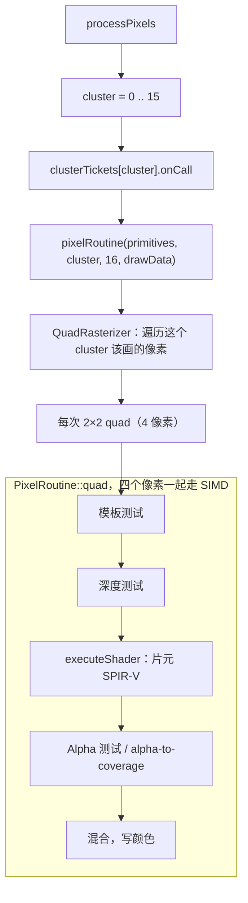
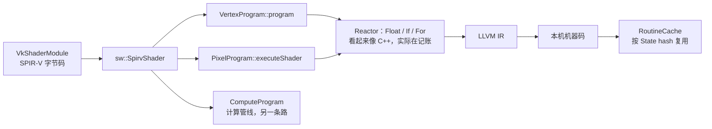
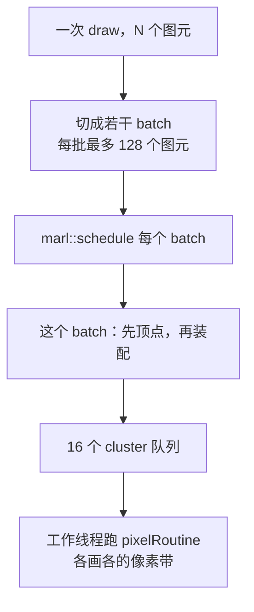

# SwiftShader 管线工作流图

本文画的是 **本仓库自己的渲染管线**（`src/Device/Renderer.cpp`、`src/Pipeline/`），不是 Mesa。

Mesa LLVMpipe 和 SwiftShader **没有代码依赖、也不在同一条调用链上**。它只是同类 CPU 软光栅，对照见 [LLVMpipeWorkflow.zh.md](LLVMpipeWorkflow.zh.md)。redroid / ARM 上真正跑的是下面这条。

面向非图形专业读者：遇到术语可回到 [SoftwareRenderingOptimization.zh.md](SoftwareRenderingOptimization.zh.md) 第 3 节。

---

## 1. 和 Mesa 的关系（先说清楚）

| | SwiftShader（本仓库） | Mesa LLVMpipe / Lavapipe |
|--|----------------------|--------------------------|
| 是什么 | Google 的 CPU Vulkan 驱动（Android 上常叫 `vulkan.pastel`） | Mesa 里另一套 CPU OpenGL/Vulkan 驱动 |
| 代码 | `src/Vulkan` + `src/Device` + `src/Pipeline` + `src/Reactor` | Mesa 的 Gallium `pipe_*` |
| 谁调用谁 | **互不调用** | **互不调用** |
| 相似点 | 都按绘制状态 JIT 一份专用函数，在 CPU 上填像素 | 同左 |
| 用它干什么 | 你的 redroid 无 GPU 路径就是它 | 对照「别人怎么给 JIT 起名字、怎么 profile」 |

所以：优化帧率要改的是 SwiftShader 这条管线；Mesa 的图不能拿来当 SwiftShader 源码地图。

---

## 2. 总览：一张图怎么从应用走到 CPU

redroid 无 GPU 时，应用并不直接碰 SwiftShader。中间还有 HWUI/Skia、GLES、ANGLE。进到本仓库之后，四层是：

**Vulkan API → Renderer（调度）→ Reactor（记录要生成的代码）→ LLVM JIT（变成可调用函数）**

应用开发者、APK、redroid 镜像 **都不用写 Reactor**。只有改 SwiftShader 源码的人才碰中间那两层。

---

## 3. 一次 `vkCmdDraw` 怎么走完

记录和执行是分开的：`vkCmdDraw` 只往命令缓冲里塞一条 `CmdDraw`；真正算像素发生在 `vkQueueSubmit` 回放时。

`Renderer::draw` 里先按当前管线状态 **取或生成三份例程**，再把这次绘制拆成若干 **batch** 丢进 marl 任务队列：

状态一变（换着色器、开关混合、改深度测试），hash 就变，可能再 JIT 一次。同样状态再来，走缓存，不再编译。

---

## 4. 三个 Processor：顶点 → 装配 → 像素

这是 SwiftShader 自己的「pipe」。对应代码：

- `src/Device/VertexProcessor.cpp` + `src/Pipeline/VertexProgram.cpp`
- `src/Device/SetupProcessor.cpp` + `src/Pipeline/SetupRoutine.cpp`
- `src/Device/PixelProcessor.cpp` + `src/Pipeline/PixelProgram.cpp`（继承 `QuadRasterizer`）

像素阶段再按 **cluster** 切开，好让多核同时填同一批三角形盖住的像素。上限 `MaxClusterCount = 16`，和 `SwiftShader.ini` 里 `ThreadCount` 默认 `min(逻辑核, 16)` 对齐。

`quad` 里没有模板就 JIT 时不会生成模板代码；没有混合就不会生成混合。这就是特化：当前绘制用到什么，机器码里才有什么。

老文档里的 `VertexPipeline` / `PixelPipeline` 是固定功能时代的类名。**当前 Vulkan 路径走的是 `VertexProgram` / `PixelProgram`（SPIR-V）**，目录在 `src/Pipeline/`，不在过时的 `src/Shader/`。

---

## 5. 着色器：SPIR-V 怎样编进那三份例程

采样走 `SamplerCore`；加减乘、纹理 LOD 等公共运算在 `ShaderCore`。x86 上部分运算会进 `rr::x86` 的 SSE 快路径；ARM 上多数靠 LLVM 自己降成 NEON，FMA / 近似倒数的开关目前仍偏 x86。那是指令层的事，不改变上面这张图的形状。

计算着色器（`vkCmdDispatch`）不走顶点/装配/像素这三段，而是 `ComputeProgram` 直接 JIT。UI / Skia 主路径几乎都是图形管线。

---

## 6. 并行怎么切：batch 和 cluster

和帧率的关系：

- **图元多**：batch 变多，顶点/装配次数变多。
- **像素多**（分辨率、MSAA）：每个 cluster 的 `pixelRoutine` 更久。云手机界面通常是像素更贵。
- **容器能看见很多核**：每个进程都可能起最多 16 条渲染线程。所以先限 `ThreadCount`，再谈改指令。

---

## 7. 你在 profile 里会看见什么

热点若是匿名可执行页 `swiftshader_jit`，对应的就是图上 **已经 JIT 出来的 vertexRoutine / setupRoutine / pixelRoutine**。其中像素例程生成时会带名字 `PixelRoutine_%08X`（`%08X` 是 shaderID），但默认 **不会** 写成 Linux `perf` 的 `/tmp/perf-PID.map`，所以 `perf report` 往往只显示匿名映射。

打开分析的顺序仍然是：先确认时间在 SwiftShader 而不是 Skia/ANGLE → 再对 JIT 页做 RIP 聚类 → 需要的话开 `REACTOR_EMIT_ASM_FILE` 对照汇编。那是剖析手段，不是另一条渲染管线。

---

## 8. 一句话

SwiftShader 的管线是 **Vulkan 命令 → Renderer 按状态取出三份 JIT 函数 → 按 batch 做顶点、按 cluster 做 2×2 像素**。Mesa 的 Gallium pipe 不在这条路上；它只是业界另一套 CPU 光栅，用来对照「JIT 也能起名字」，不能当成本仓库的模块图。
